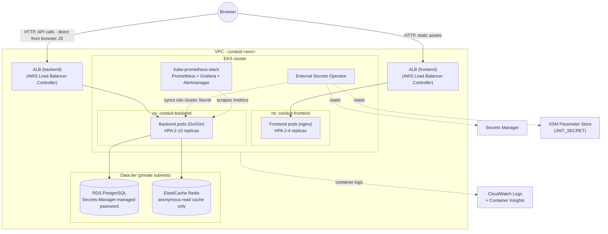
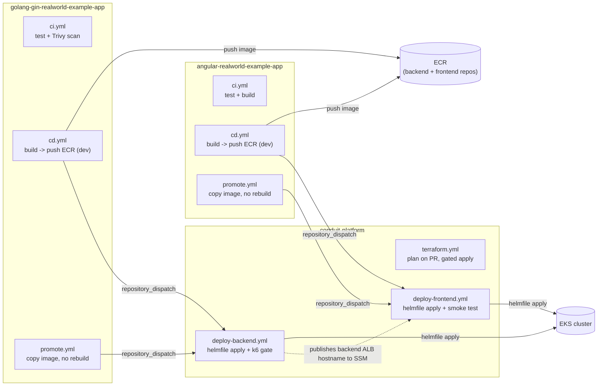

# Architecture

## Runtime

Both frontend and backend are containerized and run on EKS, each in its own namespace and behind its own ALB - the frontend moved off S3/CloudFront (see `docs/design-decisions.md` for that trade-off, and for why each tier gets its own namespace rather than sharing `default`). Postgres and Redis are both managed services, not in-cluster state, so the cluster itself needs no backup story beyond redeploying from Helmfile (see `runbooks/backup-restore.md`).

## CI/CD

Two IAM roles do all the AWS-side work in `conduit-platform`, and only there: **`terraform-ci`** (broad, runs Terraform) and **`platform-ci`** (EKS-scoped only, runs `helmfile apply`). Neither app repo's CI role can touch the cluster - see `design-decisions.md` for why that split exists and what it costs.
