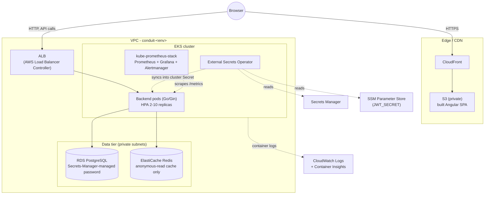
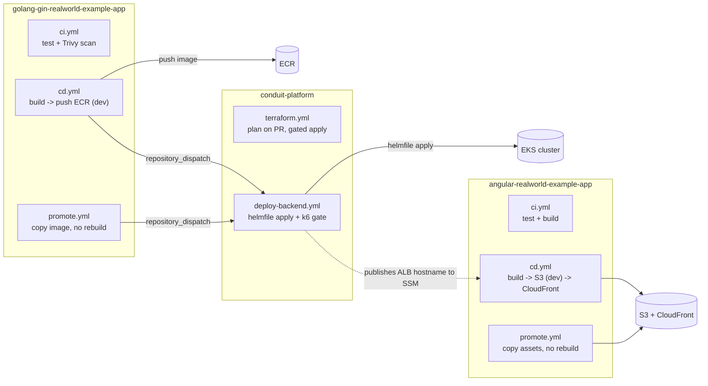

# Architecture

## Runtime

The frontend is static assets on S3/CloudFront - no compute, no cluster involvement. The backend is the only thing running on EKS. Postgres and Redis are both managed services, not in-cluster state, which is why the cluster itself needs no backup story (see `runbooks/backup-restore.md`).

## CI/CD

Two IAM roles do all the AWS-side work in `conduit-platform`, and only there: **`terraform-ci`** (broad, runs Terraform) and **`platform-ci`** (EKS-scoped only, runs `helmfile apply`). Neither app repo's CI role can touch the cluster - see `design-decisions.md` for why that split exists and what it costs.
